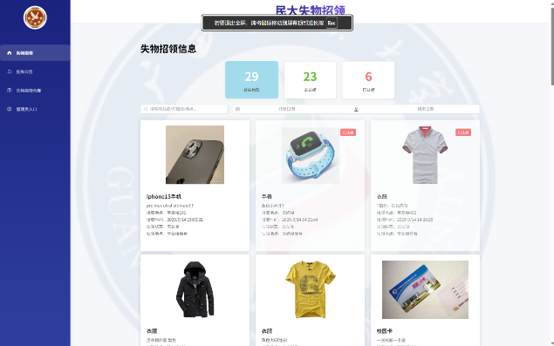
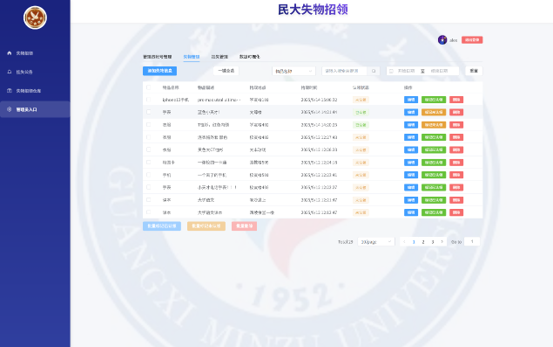
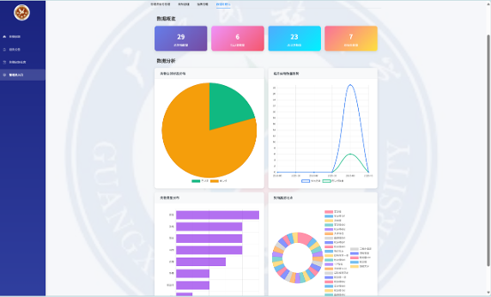

<p align="center">
  
</p>

<h1 align="center">校园失物招领系统</h1>

<p align="center">
  <b>Campus Lost & Found System</b><br/>
  基于 Express + Vue 3 的全栈校园失物招领平台
</p>

---

## 产品展示

<table>
  <tr>
    <td align="center"></td>
    <td align="center"></td>
  </tr>
  <tr>
    <td align="center">失物招领信息浏览</td>
    <td align="center">后台管理</td>
  </tr>
  <tr>
    <td align="center" colspan="2"></td>
  </tr>
  <tr>
    <td align="center" colspan="2">数据可视化统计</td>
  </tr>
</table>

---

## 核心特性

- **失物信息发布** — 发布者可上传图片、描述物品特征、选择丢失地点
- **招领信息管理** — 拾获者发布招领，失主可快速匹配
- **后台管理系统** — 管理员审核、删除、管理所有信息
- **数据可视化** — 饼图、折线图、柱状图展示丢失/招领趋势
- **搜索与筛选** — 按关键词、日期范围、信息状态筛选
- **文件上传** — 支持图片上传，本地存储
- **用户认证** — 登录注册、角色权限区分

---

## 技术栈

| 层级 | 技术 | 用途 |
|------|------|------|
| **后端** | Express.js | RESTful API 服务 |
| **数据库** | MySQL | 数据持久化 |
| **前端框架** | Vue 3 + Vite | 响应式 UI |
| **UI 组件库** | Element Plus | 表单、表格、弹窗等组件 |
| **图表** | ECharts | 数据可视化 |
| **状态管理** | Pinia | 全局状态 |
| **样式** | TailwindCSS | 原子化 CSS |
| **路由** | Vue Router | 前端路由 |
| **HTTP** | Axios | 前后端通信 |

---

## 项目结构

```
campus-lost-found/
├── src/                    # 后端源码
│   ├── config/             # 数据库、上传配置
│   ├── controllers/        # 业务逻辑控制器
│   ├── middleware/          # 中间件（错误处理、日志、上传）
│   ├── routes/             # API 路由定义
│   └── utils/              # 工具函数
├── frontend/               # 前端 Vue 3 项目
│   └── src/
│       ├── api/            # 接口封装
│       ├── config/         # 后端地址配置
│       ├── router/         # 路由配置
│       ├── store/          # Pinia 状态
│       └── views/          # 页面组件
├── public/                 # 静态资源
├── app.js                  # Express 入口
└── package.json
```

---

## 快速开始

### 环境要求

- Node.js >= 16
- MySQL >= 5.7

### 安装与运行

```bash
# 克隆项目
git clone https://github.com/wpz1212ccl/campus-lost-found.git
cd campus-lost-found

# 后端
npm install
cp .env.example .env        # 配置数据库连接
npm run dev                 # 启动后端 (端口 3000)

# 前端
cd frontend
npm install
npm run dev                 # 启动前端 (端口 5173)
```

### 环境变量 (.env)

```env
DB_HOST=localhost
DB_USER=root
DB_PASSWORD=your_password
DB_NAME=lost_and_found
PORT=3000
```

---

## API 接口

| 方法 | 路径 | 说明 |
|------|------|------|
| GET | /api/founder | 获取招领列表 |
| POST | /api/founder | 发布招领信息 |
| GET | /api/loster | 获取失物列表 |
| POST | /api/loster | 发布失物信息 |
| POST | /api/admin/login | 管理员登录 |
| GET | /api/admin/list | 管理员获取全部信息 |
| POST | /api/upload | 上传图片 |

---

## 关于开发者

**PgStar** — AI Product & Mobile App Developer

---

## License

MIT License
